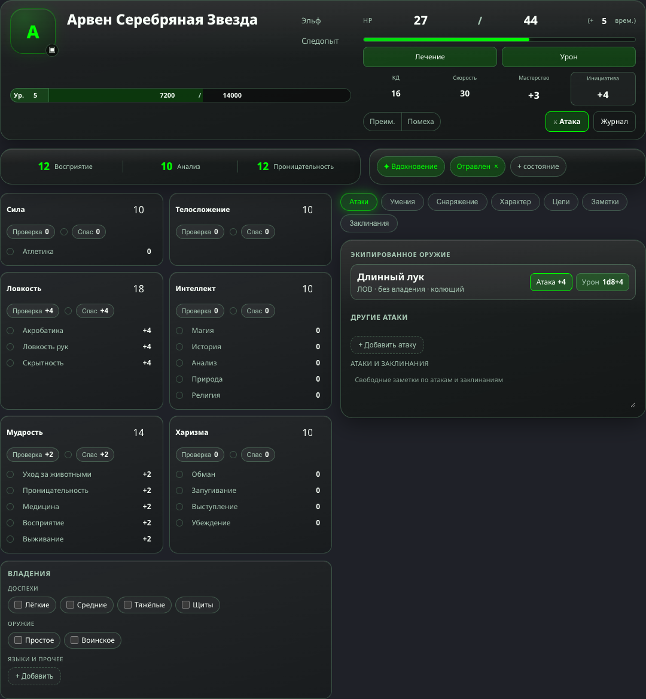
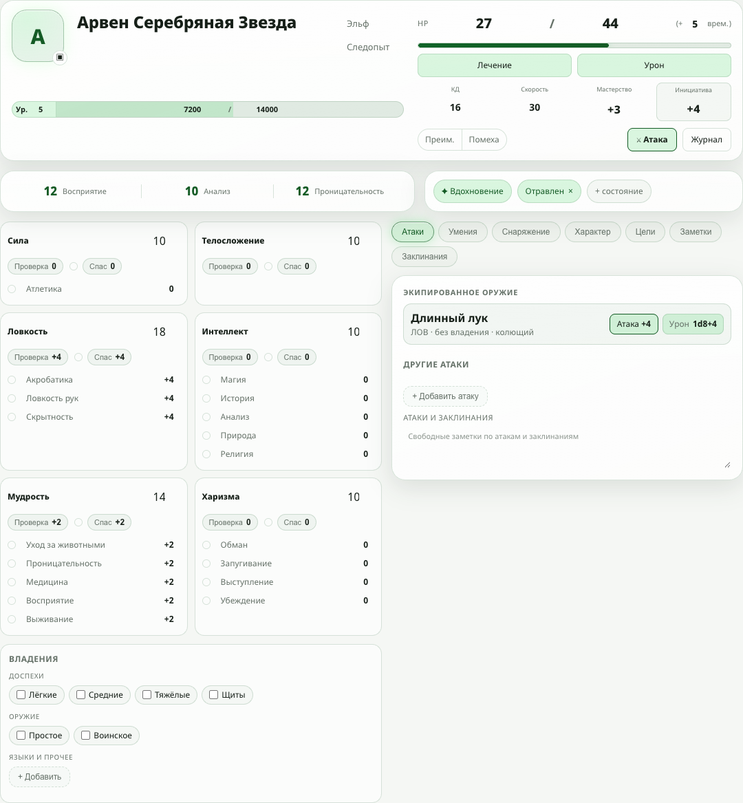

# Карточка персонажа D&D: визуальный стиль

Зафиксировано 6 октября 2026 по состоянию `dev` на `2b9e624`, до начала этапа 1
[плана](character-sheet-roadmap.md); тогда же карточке добавлена светлая тема. Эталоны
пересняты после этапа 1 (спасброски от смерти, отдых).
Документ описывает, как карточка выглядит и ведёт себя сейчас, и правила, по которым
в неё добавляются новые элементы. Новый блок должен собираться из
того, что здесь перечислено; если не получается — сначала меняется этот документ.

Стили лежат в `<style scoped>` компонента `src/components/DndCharacterSheet.vue` и его
частей `src/components/Dnd*.vue`. Страница вокруг карточки — `src/views/InteractiveTemplateView.vue`.

## Эталон

Тестовый персонаж 5 уровня. Снимки сделаны в Chrome на macOS. Тёмная тема — основная,
светлая повторяет её теми же ролями.

| Вид | Тёмная | Светлая |
|---|---|---|
| Десктоп, 1280 px | [снимок](images/character-sheet/sheet-desktop-dark.png) | [снимок](images/character-sheet/sheet-desktop-light.png) |
| Телефон, 390 px | [снимок](images/character-sheet/sheet-phone-dark.png) | [снимок](images/character-sheet/sheet-phone-light.png) |
| Тосты бросков | [снимок](images/character-sheet/sheet-toasts-dark.png) | [снимок](images/character-sheet/sheet-toasts-light.png) |
| Вкладка «Умения» | [снимок](images/character-sheet/sheet-desktop-tab-features.png) | |
| Вкладка «Снаряжение», раскрытое оружие | [снимок](images/character-sheet/sheet-desktop-tab-equipment.png) | |
| Меню состояний | [снимок](images/character-sheet/sheet-menu-dark.png) | |
| Диалог урона | [снимок](images/character-sheet/sheet-desktop-dialog.png) | |
| Спасброски от смерти (0 HP) | [снимок](images/character-sheet/sheet-death-saves.png) | |
| Диалог короткого отдыха | [снимок](images/character-sheet/sheet-rest-short.png) | |
| Диалог длинного отдыха | [снимок](images/character-sheet/sheet-rest-long.png) | |
| Кнопка «Отдых» и выбор отдыха в диалоге | [снимок](images/character-sheet/sheet-rest-choice.png) | |
| Верх листа на телефоне, 320 px: строка HP, состояния | [снимок](images/character-sheet/sheet-phone-top-320.png) | |
| Верх листа на десктопе | [снимок](images/character-sheet/sheet-desktop-top.png) | |
| Диалог HP | | [снимок](images/character-sheet/sheet-hp-dialog.png) |
| Телефон, раздел «Характеристики» | [снимок](images/character-sheet/sheet-phone-section-abilities.png) | |
| Телефон, заклинания в режиме игры | | [снимок](images/character-sheet/sheet-phone-spells-play.png) |
| Телефон, предметы в режиме игры | | [снимок](images/character-sheet/sheet-phone-equipment-play.png) |
| Телефон, раздел «Снаряжение» с кошельком | [снимок](images/character-sheet/sheet-phone-section-equipment.png) | |
| Телефон, раздел «Инфо» | [снимок](images/character-sheet/sheet-phone-section-info.png) | |
| Десктоп, раздел «Снаряжение» | [снимок](images/character-sheet/sheet-desktop-section-equipment.png) | |
| Диалог «Получить монеты» | [снимок](images/character-sheet/sheet-coins-dialog.png) | |

## Характер

- **Зелёное стекло.** Полупрозрачные панели на фоне страницы, тонкая зеленоватая
  рамка, блик по верхней кромке. В тёмной теме стекло тёмное, в светлой — белое.
- **Один акцент — зелёный:** кислотный `#00ff00` в тёмной теме, тёмно-зелёный
  `#145b25` в светлой. Им отмечено только то, что активно или
  по чему бросают: выбранная вкладка, включённое состояние, владение навыком, кнопка
  атаки, полоса HP, итог броска.
- **Значения читаются как текст.** Поле ввода в покое не имеет рамки и фона; рамка
  появляется при наведении, зелёное кольцо — в фокусе.
- **Плотно.** Это игровой лист, а не форма: мелкие подписи, крупные числа, минимум воздуха.

## Токены

Объявлены на корне `.dnd-cs` и наследуются дочерними компонентами. Тёмные значения
записаны в самой карточке; светлые заданы блоком `:root[data-theme='light'] .dnd-cs`
и берутся из общих токенов приложения (`src/style.css`).

| Токен | Тёмная тема | Светлая тема | Для чего |
|---|---|---|---|
| `--dnd-glass-bg` | `rgba(13, 17, 14, 0.72)` | `--ui-glass-bg` | фон больших панелей |
| `--dnd-glass-tint` | белый градиент `.055 → .006` | `--ui-glass-tint` | градиент поверх фона панели |
| `--dnd-glass-border` | `rgba(130, 210, 155, 0.28)` | `--ui-glass-border` | любая рамка внутри карточки |
| `--dnd-glass-highlight` | `rgba(255, 255, 255, 0.10)` | `--ui-glass-highlight` | внутренний блик по верхней кромке |
| `--dnd-glass-sheen` | `rgba(255, 255, 255, 0.08)` | `--ui-glass-sheen` | блик-градиент в верхней части панели |
| `--dnd-glass-shadow` | `0 10px 34px rgba(0, 0, 0, 0.38)` | `--ui-glass-shadow` | тень панели |
| `--dnd-glass-accent` | `#00ff00` | `--ui-accent-strong` (`#145b25`) | акцент: текст, рамка, заливка индикаторов |
| `--dnd-glass-accent-soft` | `rgba(0, 255, 0, 0.16)` | `--ui-glass-accent-bg` | фон активного элемента и кнопок действий |
| `--dnd-glass-accent-glow` | `rgba(0, 255, 0, 0.36)` | `rgba(32, 207, 69, 0.28)` | свечение активного элемента |
| `--dnd-text-dim` | `#a7c8b4` | `--ui-text-secondary` | подписи, вторичный текст, неактивные кнопки |
| `--dnd-card-bg` | градиент на `rgba(10, 14, 11, 0.5)` | `--ui-glass-card-bg` | фон внутренних карточек |
| `--dnd-fill-rgb` | `255, 255, 255` | `20, 91, 37` | цвет заливок строк, чипов и кнопок |
| `--dnd-well` | `rgba(0, 0, 0, 0.45)` | `rgba(20, 91, 37, 0.12)` | дорожка полосы |
| `--dnd-field-focus-bg` | `rgba(0, 0, 0, 0.28)` | `rgba(255, 255, 255, 0.9)` | фон поля в фокусе |
| `--dnd-portrait-shade` | `rgba(0, 0, 0, 0.25)` | `rgba(20, 91, 37, 0.08)` | затемнение в градиенте портрета |
| `--dnd-solid` | `rgba(10, 14, 11, 0.85)` | `--ui-surface-solid` | непрозрачная подложка мелких кнопок поверх портрета |
| `--dnd-danger` | `#ff6b6b` | `--ui-danger-foreground` | удаление, провал |
| `--dnd-glass-radius` | `20px` | то же | радиус больших панелей |

Основной текст — `var(--ui-text)`. Ошибки и некорректный ввод — `var(--ui-danger-foreground)`.

Правила:

- Цвет в стилях карточки берётся только из токенов. Новый литерал цвета — повод
  остановиться: он почти наверняка сломает одну из тем.
- Заливка строки, чипа или кнопки пишется как `rgba(var(--dnd-fill-rgb), <ступень>)`.
  Ступени: `.02`–`.03` — чип, вкладка и «добавить» в покое, `.04`–`.05` — строка
  списка и кнопка, `.06` — строка под курсором. Новых ступеней не добавляем.
- В дочернем компоненте — с запасным значением: `rgba(var(--dnd-fill-rgb, 255, 255, 255), .04)`.
- Новый токен добавляется сразу в обе темы.
- Каждый новый элемент проверяется в обеих темах.

## Поверхности

Три уровня, вложенные друг в друга. Четвёртого нет.

| Уровень | Класс | Вид | Где |
|---|---|---|---|
| Панель | `.dnd-glass` | `--dnd-glass-bg` + `--dnd-glass-tint`, рамка, радиус 20, тень, **размытие 18 px** | верхняя карточка, пассивные значения, состояния, панель вкладки |
| Внутренняя карточка | `.dnd-cs-ability`, `.dnd-cs-proficiencies` | `--dnd-card-bg`, рамка, радиус 14, **без размытия** | характеристики, владения |
| Строка | `.dnd-cs-*-row`, `.dnd-weapon-attack` | заливка `.025`–`.05`, рамка, радиус 12 | атака, умение, предмет, цель, заклинание |

- `backdrop-filter` стоит только на панелях. Их на экране единицы; на строках и
  кнопках размытия нет — их десятки, и это дорого.
- Вложенный блок настроек внутри строки (поля оружия) — пунктирная рамка, радиус 10.
- Панель не кладётся в панель.

## Форма

| Радиус | Что |
|---|---|
| `20px` | панель |
| `14px` | внутренняя карточка, тост, панель вкладок |
| `12px` | строка списка, пунктирная кнопка «добавить», всплывающее меню |
| `8px` | поле ввода, квадратная кнопка, кнопка действия |
| `999px` | чипы, кнопки бросков, переключатель «Преим. / Помеха», полосы |

Рамка везде `1px`. Пунктир — только у «добавить» и у вложенного блока настроек.

## Типографика

Шрифт наследуется от приложения. Числа, которые меняются, — с `font-variant-numeric: tabular-nums`.

| Роль | Размер и начертание |
|---|---|
| Имя персонажа | 24 px / 800 (телефон — 20 px) |
| Крупное число (HP) | 20 px / 800 |
| Значение характеристики | 18 px / 800 |
| Значение боевого параметра | 14–16 px / 700–800 |
| Название в строке списка | наследуемый размер / 600 |
| Основной текст кнопок, чипов, навыков | 12 px |
| Подпись параметра, заголовок секции | 9–12 px, ПРОПИСНЫЕ, трекинг `.04`–`.06em`, цвет `--dnd-text-dim` |

Прописные с трекингом — только для подписей и заголовков секций, не для значений и кнопок.

## Элементы

| Элемент | Класс | Вид |
|---|---|---|
| Поле ввода | `.dnd-cs input`, `textarea` | прозрачное; наведение — заливка `.045` и рамка; фокус — фон `--dnd-field-focus-bg`, акцентная рамка, кольцо `0 0 0 3px` из `accent-soft` |
| Поле в дочернем компоненте | как в `DndWeaponFields` | рамка и заливка `.045` видны всегда; фокус — как выше |
| Кнопка действия | `.dnd-cs-hp-button`, `.dnd-weapon-attack-roll` | фон `accent-soft`, радиус 8, текст `--ui-text`; главная — с акцентной рамкой и жирным текстом |
| Кнопка броска | `.dnd-cs-roll` | пилюля, приглушённый текст, число белым; наведение — акцент и свечение |
| Квадратная кнопка | `.dnd-cs-hp-btn` 24 px, `.dnd-cs-row-remove` 26 px, `.dnd-cs-weapon-toggle` 30 px | рамка, радиус 8; наведение — акцент, у удаления — `--dnd-danger` |
| «Добавить» | `.dnd-cs-add` | пунктирная рамка, радиус 12, приглушённый текст; наведение — акцент |
| Панель вкладок | `.dnd-cs-tabs` | одна плашка: рамка, радиус 14, заливка `.03`, отступ 3 px; внутри сегменты **одинаковой ширины**, у каждого иконка и название. Сегмент — радиус 11, без своей рамки; выбранный — акцентный текст, `accent-soft`, акцентная рамка, свечение, жирное название. На широком экране иконка слева от названия (38 px), на телефоне — над ним (52 px) |
| Чип | `.dnd-cs-state-list button`, `.dnd-cs-prof-group label` | пилюля; включённый — акцентный текст на `accent-soft` |
| Точка-индикатор | `.dnd-cs-pip` | кружок 12 px; пустой — рамка, включённый — акцентная заливка со свечением, экспертиза — кольцо, половина — приглушённая заливка |
| Полоса | `.dnd-cs-hp-bar`, `.dnd-cs-xp-bar` | дорожка `--dnd-well` с рамкой, акцентная заливка |
| Тихая кнопка | `.dnd-cs-init-button`, `.dnd-cs-rest-button` | заливка `.03`–`.05`, приглушённый текст, наведение — `accent-soft`. Бросок инициативы — радиус 8, в конце строки HP, модификатор белым; «Отдых» — пилюля среди состояний |
| Блок-предупреждение | `.dnd-cs-death` | строка внутри панели с рамкой цвета `--dnd-danger` на 40%, радиус 12, заливка `.04`; внутри — подписи, точки и кнопка броска. Точки провалов заливаются `--dnd-danger` |
| Счётчик с тратой | `.dnd-cs-uses` | «− остаток/всего +»: квадратные кнопки по краям, «всего» — поле. Заряды умений и ячейки заклинаний |
| Значение-справка | `.dnd-cs-spell-dc` | рамка, радиус 8, высота как у кнопки рядом, приглушённый текст, без заливки и без наведения: это число для чтения (Сл спасброска), а не кнопка |
| Заголовок группы | `.dnd-cs-spell-level` | подзаголовок прописными слева, счётчик группы справа в той же строке |
| Выпадающий список | `DndSelect` | кнопка-поле: рамка и заливка `.045`, радиус 8, шеврон справа; открытый — акцентное кольцо, как фокус поля. Рядом подпись прописными. Системный `<select>` на листе не используется |
| Список-значение | `DndSelect variant="plain"` в `DndIdentitySelect` (раса, класс) | тот же список, но в покое читается как значение: без рамки, фона и шеврона; наведение и фокус — как у поля. Длинное значение обрезается многоточием, полное — в подсказке |
| Список вариантов | `.dnd-select-list` | одно стекло на весь список: `--ui-glass-tint` + `--ui-glass-bg`, размытие, радиус 14, отступ 6; пункты с радиусом 10, под курсором `--ui-glass-btn-hover`, выбранный — `--ui-glass-accent-bg` с акцентным текстом и галочкой. На телефоне пункт не ниже 44 px |
| Кошелёк | `DndWallet` | внутренняя карточка в начале «Снаряжения»: подзаголовок «Монеты» и пять ячеек-монет в одну строку (подпись прописными, под ней число 16 px / 800). Ячейка — **кнопка**, не поле: деньги не перебивают, а получают и тратят. Ни суммы «всего», ни кнопок под ячейками нет. Цвета монет не используем: только токены |
| Переключатель | `.dnd-roll-mode` | сегменты в одной пилюле, выбранный — `accent-soft` и акцентная обводка |

Состояния одинаковы у всех: отключённое — `opacity: .45` и обычный курсор; фокус с
клавиатуры виден (кольцо или `outline` акцентом); переходы 130–200 мс.

## Шапка страницы

Над карточкой — прозрачная шапка страницы: кнопка «назад» слева, справа статус,
подключение к канвасу и меню аккаунта. Всё в ней — стеклянные пилюли высотой 36 px на
общих токенах `--ui-glass-*` (шапка вне `.dnd-cs`).

| Элемент | Вид |
|---|---|
| Статус (`DndSyncStatus`) | на широком экране — текст 13 px без рамки, предупреждение цветом ошибки, пусто, когда всё в порядке. На телефоне (до 760 px) — цветная точка в ячейке постоянной ширины: акцент — всё сохранено, жёлтая — сохраняем, красная — нет связи или сообщение, серая — только просмотр |
| Режим (`.dnd-mode-button`) | пилюля «▶ Игра» / «✎ Настройка». В «Настройке» текст и рамка цветом акцента. Читателю не показывается. Уже 420 px — только значок |
| Отменить / Вернуть (`.dnd-undo-button`) | две пилюли слева от режима, только в «Настройке». Пустой стек — кнопка приглушена. На телефоне — только значки |
| Бросок по формуле (`DndQuickRoll`) | круглая кнопка с костью, только в «Игре». Меню-стекло: поле формулы, «Бросить», кости к4–к100, которые складываются в формулу нажатиями. После броска остаётся открытым |
| История (`DndSheetHistory`) | пилюля с часами. В панели, кроме записей изменений, — список «Броски · N»: журнал бросков этой вкладки. Отдельной кнопки журнала на листе нет |
| Меню аккаунта (`AccountMenu glass`) | круглая кнопка с инициалом, самая правая. Меню — одно стекло: радиус 20, размытие, рамка `--ui-glass-border`; тема — сегменты в одной пилюле, выбранный подсвечен акцентом; пункты с радиусом 12 и высотой 40 px (44 на телефоне); «Выйти» цветом ошибки |
| Подключение к канвасу (`DndCanvasLinkMenuItem`) | строка меню аккаунта в две строки: «Доска для бросков» и состояние. Точка пустая — не подключён, залита акцентом — броски идут в чат, цветом ошибки — подключён, но броски остаются локальными |

Правила шапки:

- **Шапка не двигается.** Всё, что меняется само (статус, состояние подключения), занимает
  место постоянной ширины или живёт в меню. Текст, который появляется и исчезает между
  кнопками, на телефоне недопустим.
- **В шапке — действия, в меню — состояния и настройки.** То, чем пользуются каждую
  минуту (назад, вкладки, режим, отмена, история), стоит кнопками. То, что настраивают
  один раз за игру (подключение к канвасу, тема), лежит в меню аккаунта.
- **Страница добавляет свои пункты в меню аккаунта** через его слот; окна, которые эти
  пункты открывают, живут на странице, а не в меню — иначе они закрылись бы вместе с ним.
- Состояние, которое касается всего листа, живёт в шапке или в меню, а не в карточке;
  подробности и действия — в окне по нажатию.

Стеклянное меню аккаунта включено пока только на странице листа (`glass`); остальные
страницы переводятся на него по одной, после чего прежний вид убирается.

## Окна поверх карточки

Диалоги, меню и подсказки вынесены в `body` через `<Teleport>` и **не видят токены
`.dnd-cs`**. Они собраны на общих токенах приложения:

| Что | Вид |
|---|---|
| Диалог (`DndHpDialog`, `DndRestDialog`, `DndRollLog`, `DndWeaponCatalog`, `DndSpellCatalog`, общий `AppDialogHost`) | затемнение `rgba(0,0,0,.45)`, окно `--ui-surface-solid`, рамка `--ui-border`, радиус 16, тень `--ui-glass-shadow`, ширина до 340–480 px; кнопки — общие `.btn-ghost` и `.btn-primary`, по центру |
| Меню и список вариантов (`AccountMenu glass`, `.dnd-select-list`) | стекло — см. «Меню» ниже |
| Подсказка-пояснение (`.dnd-formula-hint`) | как меню: `--ui-surface-solid`, рамка, радиус 12, текст 13 px, ширина до 300 px |
| Подсказка-пилюля (`.dnd-cs-passive-help`) | общий класс `.mobile-modebar-tap-hint`: стекло на `--ui-glass-*`, текст 11 px по центру, радиус 14, ширина до 320 px |
| Тост броска (`DndRollToasts`) | стекло с акцентной рамкой, радиус 14, размытие 14 px; свои токены `--toast-*` на `.dnd-cs-toasts` для обеих тем; крит — усиленное свечение, провал — красная рамка |

Новое окно берёт вид у существующего того же типа. Как окна открываются и
закрываются — в разделе «Поведение».

Диалог-выбор с крупными блоками (`InteractiveTemplatePicker` на дашборде: пустой лист,
канбан-доска, импорт персонажа) — тот же диалог, шириной до 720 px. Блок внутри — это
«внутренняя карточка» на общих токенах: фон `--ui-glass-tint` + `--ui-glass-card-bg`,
рамка `--ui-glass-border`, радиус 14, без размытия; под курсором — `--ui-glass-card-hover`
и рамка `--ui-glass-accent-border`. Значок блока — квадрат 40 px с радиусом 12 на
`--ui-glass-accent-bg`; название 15 px / 700, пояснение 12 px `--ui-text-secondary`.
На экране уже 620 px блоки идут строками: значок слева, текст справа, не ниже 44 px.

### Меню

Меню — всё, что всплывает у кнопки и предлагает пункты: меню аккаунта, список вариантов
выпадающего списка, меню состояний, выбор оружия. Образец — меню аккаунта
(`AccountMenu` с `glass`) и список `DndSelect`.

Поверхность:

| Свойство | Значение |
|---|---|
| Фон | `var(--ui-glass-tint), var(--ui-glass-bg)` |
| Размытие | `blur(var(--ui-glass-blur)) saturate(1.2)` — одно на всё меню |
| Рамка | `1px solid var(--ui-glass-border)` |
| Тень | `inset 0 1px 0 var(--ui-glass-highlight), var(--ui-glass-shadow)` |
| Радиус | 20 px у меню с разделами (аккаунт), 14 px у простого списка |
| Отступ | 10 px у меню с разделами, 6 px у списка |
| Ширина | по содержимому, не уже кнопки и не шире `100vw − 24px`; у меню аккаунта — до 280 px |
| Высота | список длиннее 300 px прокручивается внутри себя |

Пункт:

| Свойство | Значение |
|---|---|
| Высота | 34–40 px, на телефоне не ниже 44 px |
| Радиус | 10–12 px |
| Текст | 13 px (14 px на телефоне в списке), `--ui-text`; значок слева — `--ui-text-secondary` |
| Под курсором и в фокусе | фон `--ui-glass-btn-hover`; фокус с клавиатуры виден |
| Выбранный | фон `--ui-glass-accent-bg`, текст `--ui-glass-accent-text`, галочка справа |
| Опасное действие («Выйти») | текст и значок `--ui-danger-foreground`, фон как у остальных |
| Пункт в две строки | заголовок 13 px, под ним состояние 12 px `--ui-text-secondary`; слева точка состояния |

Разделы и переключатели внутри меню:

- Разделы отделяются линией `1px solid var(--ui-glass-border)`, без заголовков-плашек.
  Подпись раздела, если нужна, — 10 px прописными, как подписи в карточке.
- Выбор из двух-трёх вариантов (тема) — сегменты в одной пилюле: рамка
  `--ui-glass-border`, фон `--ui-glass-btn-bg`; выбранный сегмент — `--ui-glass-accent-bg`,
  рамка `--ui-glass-accent-border`, свечение `--ui-glass-accent-glow`.

Правила:

- **Одно стекло на меню.** Внутри ничего не размывается повторно; у пунктов нет
  собственных рамок и теней.
- **Только токены `--ui-glass-*`.** Меню вынесено в `body` и токены `.dnd-cs` не видит;
  литералов цвета нет, поэтому обе темы работают без отдельных правил.
- **Акцент — только на выбранном.** Наведение акцентом не красится.
- **Порядок в меню аккаунта:** кто вошёл, тема, пункты страницы, общие пункты, выход.
  Пункты страницы приходят через слот `page` и стоят над общими.
- **Меню не анимируется:** появляется и исчезает сразу, как остальные всплывающие окна.
  Шторка снизу — не меню, у неё движение есть (раздел «Анимации»).
- **Состояние в меню — словами.** Точка дублирует цветом, но не заменяет текст: «Доска
  для бросков» + «Проклятие Страда», а не одна точка.
- **Системных выпадающих меню на листе нет** (`<select>`): их нельзя оформить.
- Поведение — как у всех меню листа: раздел «Всплывающие меню».

Диалоги стеклом не делаются: в них читают и вводят, им нужна непрозрачная подложка.

## Раскладка

- Корень — колонка с шагом 14 px: верхняя карточка, строка «пассивные значения +
  состояния», тело в две колонки (характеристики слева, вкладки справа).
- **Разделов пять:** «Характеристики», «Атаки и умения», «Снаряжение», «Заклинания»,
  «Инфо» (цели, характер, заметки, владения). Новый раздел не добавляем — новое
  содержимое идёт блоком с подзаголовком в один из них.
- На широком экране характеристики всегда стоят слева и своей вкладки не имеют: вкладок
  четыре. Сохранённый раздел «Характеристики» там открывает «Атаки и умения».
- На телефоне вкладок пять, одной строкой над содержимым, **без прокрутки** и на 320 px.
  Раздел показывается один: «Характеристики» — это только характеристики с навыками.
- **Вкладки — панель, а не ряд чипов:** сегменты равной ширины в одной плашке, у каждого
  иконка. Отдельными пилюлями разной ширины вкладки не делаем: так они читаются как
  чипы-фильтры.
- Чтобы пять равных сегментов помещались, под иконкой стоит короткое название: «Статы»,
  «Атаки», «Вещи», «Магия», «Инфо». Полное название («Характеристики», «Атаки и умения»,
  «Снаряжение», «Заклинания») — это имя вкладки для экранных читалок и её подсказка.
  От 560 px названия полные, кроме «Атаки»: «Атаки и умения» в равный сегмент рядом с
  иконкой не помещается и на широком экране.
- **Верхняя карточка — имя, опыт и одна строка HP.** Ряда кнопок в ней нет. Строка HP:
  слева кнопка «HP» (всё, что меняет хиты), за ней текущие и максимальные хиты и, в
  скобках, временные; справа, в конце строки, — бросок инициативы («Инициатива» и
  модификатор; на телефоне название над числом). Под строкой полоса HP. Строка обязана
  помещаться на 320 px с трёхзначными хитами: числа занимают ровно свою ширину, на
  телефоне временные HP пишутся коротко, «(+12)», и не показываются, пока их нет.
- **Хиты на листе читают, а не вписывают.** Текущие и временные HP не редактируются
  нигде; максимум — поле только в режиме настройки. Меняются хиты кнопкой «HP».
- **Преимущество / помеха и «Отдых» стоят в блоке состояний**, сразу после «Вдохновения»
  и перед состояниями: постоянные кнопки не сдвигаются, когда список состояний растёт. Это
  то, чем настраивают ход, а не то, что бросают. Кнопки «Атака» в шапке листа нет —
  атаки бросают из раздела «Атаки».
- КД, скорость и мастерство — значения, в которые заглядывают: на широком экране они
  стоят в верхней карточке под полосой HP, на телефоне уходят в раздел «Характеристики»
  отдельной панелью, под ней пассивные характеристики, ниже — сами характеристики.
  Состояния на телефоне остаются над вкладками.
- **В режиме игры строка списка — одна линия.** Список читают и по нему бросают, а не
  правят: пустое поле «Заметки» не показывается вовсе, непустое — приглушённая строка
  12 px под названием; уровень заклинания в строке не повторяется (он в подзаголовке
  группы); название и кнопки бросков стоят в одну линию, пока помещаются; колонки под
  скрытые кнопки «оружие» и «удалить» не резервируются. В режиме настройки строки
  прежние, со всеми полями.
- Блоки внутри одного раздела отделяются подзаголовком прописными и отступом 14 px
  (`.dnd-cs-section-gap`). Пустой список в режиме игры говорит об этом строкой
  («Целей пока нет.»), а не оставляет голый подзаголовок.
- Сохранённое значение `activeTab` осталось прежним, более дробным: его же использует
  старая карточка на канвасе. Лист открывает по нему раздел и записывает раздел первым
  из его значений.
- Отступы внутри панели 12–16 px, внутри строки 8 px, между строками 8 px, между
  кнопками 6 px.
- Единственная точка перелома — `760px`. Ниже неё всё в одну колонку, характеристики
  остаются по две в ряд.
- На телефоне кнопки, которые нажимают каждый ход, — не ниже 44 px. Исключение —
  «−» и «+» у ячеек заклинаний: 30 px, чтобы строка уровня оставалась в одну линию.
- Ничто не выходит за ширину карточки на 320 px: длинные подписи переносятся
  (`overflow-wrap: anywhere`), ряды кнопок заворачиваются (`flex-wrap`).

## Технические правила

- Стили `scoped`: правила родителя для `input` и `button` не действуют внутри дочернего
  компонента. Дочерний компонент описывает свои поля сам, по образцу `DndWeaponFields`.
- Компонент, который может оказаться вне `.dnd-cs`, подставляет запасные значения:
  `var(--dnd-glass-border, var(--ui-border))`, как в `DndFormulaButton`.
- У числовых полей в плотных местах скрыты стрелки (`appearance: textfield`).
- Системный `<select>` на листе не используется: его выпадающее меню рисует система,
  оформить его нельзя, а однажды его пункты вышли невидимыми в тёмной теме. Выбор из
  списка — это `DndSelect`; он ведёт себя как остальные всплывающие меню листа и как
  `listbox` для клавиатуры (стрелки, Home и End, переход по набранным буквам, Enter,
  Esc). Проверяет это `tests/character-sheet-selects.spec.ts`.
- У каждого поля и кнопки без текста есть `aria-label` — на них опираются тесты
  `tests/character-sheet-header.spec.ts`.
- Подписи пока только на русском.

## Поведение

### Правка и сохранение

- Кнопки «Сохранить» нет. Поле отправляет значение, когда правка закончена (`change`:
  потеря фокуса или Enter), а не на каждый символ. Переключатели, чипы и кнопки
  «±» срабатывают сразу.
- Компонент меняет данные и сообщает `change`; страница сама превращает разницу в
  операции. HP и заряды умений уходят отдельными операциями-дельтами (`op`), чтобы
  одновременные изменения складывались.
- Состояние связи — короткий текст в шапке страницы рядом с меню аккаунта:
  «Сохраняем…», «Нет связи — изменения отправятся при подключении» (цветом ошибки),
  «Только просмотр», «Нет доступа». Когда всё сохранено, текста нет.
- Значение, у которого есть короткий известный набор (раса, класс), выбирается из
  списка, а не печатается. Последний пункт списка («Другая…») включает ввод своего
  варианта прямо на месте списка; Esc или уход из поля без правки возвращает список.
  Значение, которого в списке нет, показано своим пунктом, а не теряется.
- Выбор из списка проставляет и то, что из него следует по правилам (скорость расы,
  кость хитов и заклинательный класс), одной правкой. Свой вариант ничего больше не
  меняет.
- «+ Добавить» дописывает пустую строку в конец списка; «×» удаляет строку сразу, без
  подтверждения.
- Строка с дополнительными настройками (оружие, заклинание) раскрывается кнопкой в
  самой строке, настройки появляются под ней, а не в окне. Если раскрытие ничего не
  меняет в листе (параметры заклинания), оно у каждого зрителя своё и доступно в
  режиме просмотра.
- Настроенное превращается в кнопки броска прямо в строке; пока настроек нет, строка
  остаётся чистой.
- Чего не хватает для броска, сказано словами рядом с полем («Выберите заклинательную
  характеристику»), а не скрыто.
- Выбранная вкладка и режим отображения — у каждого зрителя свои и не синхронизируются.
- **Только просмотр:** поля `readonly`, переключатели отключены, кнопки удаления и
  добавления скрыты. Броски остаются доступны — они ничего не меняют в листе.

### Подсказки

Два вида, по ситуации:

| Вид | Когда | Как ведёт себя |
|---|---|---|
| Системная (`title`) | пояснение к кнопке, понятной и без него: что бросается, что значит «Преим.» | показывает браузер при наведении; на телефоне не видна, поэтому несёт только дополнительные сведения |
| По нажатию (`role="tooltip"`) | пояснение, без которого значение непонятно: пассивная характеристика, нераспознанная формула | открывается нажатием на сам элемент, закрывается повторным нажатием, нажатием мимо, Esc, системным «Назад» или сама по таймеру |

Подсказка по нажатию:

- привязана к элементу: над ним по центру (пассивные значения) или под ним с
  переворотом вверх, если снизу нет места (формула); от элемента 8 px;
- не ближе 12 px к краю окна, следует за элементом при прокрутке и изменении размера;
- до первого измерения скрыта (`visibility: hidden`), чтобы не мигать в углу;
- гаснет сама: 3 с для короткой, 6 с для той, которую надо прочитать;
- у элемента `aria-expanded` и `aria-describedby`;
- текст — одно-два предложения: что это и что сделать.

Элемент, который нельзя использовать, не прячется, а объясняет причину: «Атака» без
экипированного оружия отключена с подсказкой, нераспознанная формула показана как
есть с «?» и пунктирной рамкой ошибки.

### Всплывающие меню

Общая механика — `src/composables/useSheetPopup.ts`.

- Открывается нажатием на кнопку, повторное нажатие закрывает. У кнопки `aria-expanded`.
- Закрывается нажатием мимо, Esc и системным «Назад»; Esc и выбор пункта возвращают
  фокус на кнопку.
- Появляется под кнопкой с отступом 6 px, выравнивается по её левому краю; если снизу
  не помещается — над ней; не ближе 12 px к краю окна; следует за кнопкой при прокрутке.
- При открытии с клавиатуры фокус переходит на первый пункт.
- Меню показывается, только когда есть из чего выбирать: «Атака» с одним оружием
  бросает сразу, с несколькими — спрашивает, чем.
- Выбор пункта закрывает меню и сразу применяется, кнопки «ОК» нет.
- Длинное меню прокручивается внутри себя (до 280 px), а не растягивает страницу.

### Диалоги

- Для действия, которому нужно число или выбор из длинного списка: урон и лечение,
  журнал бросков, каталог оружия.
- Закрываются по Esc, нажатию на затемнение, системному «Назад» и кнопке отмены или «×».
- При открытии фокус встаёт на первое поле (или на «×», если полей нет), при закрытии
  возвращается на кнопку, которой диалог открыт. Tab не выходит за пределы диалога.
- **Диалог HP (`DndHpDialog`) один на всё, что меняет хиты.** Открывается кнопкой «HP»,
  фокус в поле количества. Сверху «Сейчас: 17 / 24 (+0 врем.)», под полем три строки —
  что останется после урона, после лечения и с такими временными HP. Внизу три кнопки:
  «Урон», «Лечение», «Временные». Как и у диалога монет, действия по умолчанию нет:
  Enter ничего не выбирает, закрывают «×», Esc, нажатие мимо и «Назад». Урон и лечение
  уходят дельтами, временные HP — значением: новое заменяет прежнее, а не складывается.
- Enter применяет. Главная кнопка называет действие («Урон», а не «ОК») и отключена,
  пока ввод некорректен.
- Результат показан до применения: «После: 22 / 44 (+0 врем.)», обновляется по мере ввода.
- **Отдых — одна кнопка.** Короткий или длинный выбирается в самом диалоге,
  переключателем из двух сегментов под заголовком (открывается на коротком); под ним
  строка о том, что это за отдых, и список изменений именно для выбранного. Главная
  кнопка называет выбранное: «Короткий отдых» или «Длинный отдых». Фокус при открытии
  стоит на выбранном сегменте, стрелки влево и вправо переключают.
- Диалог-подтверждение (отдых) перечисляет, что изменится: «HP: 6 → 30», «Кости
  хитов: 1 → 3 из 4», «Умения: …». Если менять нечего — так и пишет.
- Действие, которое повторяют (трата кости хитов), не закрывает диалог и не уводит
  фокус с кнопки: следующее нажатие — следующая кость.
- Кнопки диалога не шире окна: общее правило приложения растягивает `.btn-primary` и
  `.btn-ghost` на телефоне на 100%, в диалогах карточки это отменено (`width: auto`).
- Диалог-каталог (оружие, заклинания): поле поиска в фокусе при открытии, список по
  группам с подзаголовками прописными, строка — название, справа действие, ниже
  приглушённые факты и суть. Высота окна постоянная, список прокручивается внутри.
  Фильтры — пилюли над списком; выбранная — на `--ui-glass-accent-bg`.
- Если из каталога берут по одному (оружие), выбор закрывает окно; если помногу
  (заклинания) — окно остаётся, а взятое помечается «в листе» и повторно не добавляется.
- Пункт, который стал недоступен после нажатия, не получает `disabled`, а помечается
  `aria-disabled`: иначе фокус выпадает из окна и Esc перестаёт его закрывать.
- Данные каталога, которые нужны только в окне, подгружаются при его открытии; пока
  их нет, окно пишет «Загружаем список…», а при ошибке — что можно добавить вручную.
- На телефоне диалог остаётся окном по центру, не превращается в шторку.
- **Системных окон в приложении нет** — ни на листе, ни вне его. `window.confirm`,
  `alert` и `prompt` заменены общим диалогом (`src/composables/appDialog.ts`, рисует
  `AppDialogHost`): `confirmDialog`, `alertDialog`, `promptDialog` возвращают промис.
  Он выглядит как диалоги листа (ширина до 380 px) и так же закрывается. Правила:
  - заголовок — сам вопрос («Удалить канвас «План»?»), строка под ним — что ещё
    произойдёт; главная кнопка называет действие («Удалить», «Выйти»), а не «ОК»;
  - разрушительное действие (`danger`): главная кнопка на `--ui-danger`, фокус при
    открытии стоит на «Отмена», чтобы Enter сам ничего не удалил; у обычного вопроса
    фокус на главной кнопке;
  - ввод строки: поле заполнено и выделено, пустое значение не принимается, Enter
    применяет;
  - вопросы показываются по одному, в порядке появления; окно стоит поверх остальных
    окон приложения и первым отвечает на системное «Назад»;
  - в Android вопрос перед выходом из приложения — этот же диалог.
- Диалог монет (`DndCoinsDialog`) один, открывается нажатием на любую монету и ставит
  фокус в её поле. Сверху «В кошельке: …», ниже пять полей в одну строку, заполняется
  несколько сразу. Под полями две строки — что будет, если получить, и что будет, если
  потратить; обе обновляются по мере ввода. Внизу две кнопки: «Потратить» и «Получить».
  Это единственный диалог листа с двумя действиями, поэтому действия по умолчанию у него
  нет: Enter ничего не делает, закрывают его «×», Esc, нажатие мимо и «Назад».
  Трата считается по стоимости: не хватает монет нужного вида — берутся более мелкие,
  затем разменивается крупная, сдача возвращается золотом, серебром и медью, а строка
  дописывает «с разменом». Не хватает всего кошелька — «не хватает 3,5 зм», и «Потратить»
  отключена.
- Импорт из файла сначала показывается, потом создаётся: окно называет персонажа и
  двумя списками перечисляет, что перенесётся и что нет (с причиной). Кнопки —
  «Другой файл» и «Создать персонажа». Файл, который не подошёл, отклоняется словами
  под блоками, окно остаётся открытым.

### Броски

- Результат броска — тост в левом нижнем углу; новые встают над старыми.
- Одновременно не больше четырёх тостов, на телефоне видны два. Тост гаснет через
  10 с или по «×».
- Тост атаки не гаснет, пока по нему не брошен урон: в нём кнопки урона, и он стоит
  первым. При крите кнопка называется «Крит».
- Натуральная 20 — усиленное зелёное свечение, натуральная 1 — красная рамка и
  красный итог.
- «Преим.» и «Помеха» действуют на один следующий бросок d20 и сбрасываются после
  него; повторное нажатие отключает.
- Журнал хранит 30 последних бросков вкладки; он открывается из шапки, в панели
  «История», переключателем «Броски · N».
- Бросок не с листа, а по своей формуле — кнопкой с костью в шапке. Он идёт туда же,
  куда все броски: в тосты, в журнал и, у подключённого листа, в чат доски.
- Лист, подключённый к канвасу, сам не бросает: бросок делает сервер, и тост
  появляется, когда пришёл ответ (обычно сразу). Пока ответа нет, ничего не
  показывается; если его не будет, в шапке написано «Нет связи — бросок не сделан».
- Тот же бросок появляется в чате канваса. Если отправить его туда нельзя, лист
  бросает сам и говорит об этом в шапке, а не молчит.
- Бросок, который меняет лист (спасбросок от смерти, кость хитов), сразу применяет
  результат и показывает его в тосте словами: «Спасбросок от смерти · успех».

### Блоки по условию

- Блок, нужный только в особом состоянии, появляется сам и сам исчезает: спасброски
  от смерти видны только при 0 HP.
- Он встаёт в поток панели и сдвигает остальное вниз, а не перекрывает его.
- Когда бросать больше нечего, кнопку заменяет итог: «Стабилен» или «Мёртв».
- Значение, которое считает лист, можно поправить рукой: точки спасбросков нажимаются
  (нажатие на последнюю заполненную снимает её).

### Анимации

| Что | Как |
|---|---|
| Наведение, фокус, включение | переход цвета, фона, рамки и тени за 130–160 мс |
| Заполнение полос HP и опыта | ширина за 200 мс |
| Нажатие кнопки броска | сдвиг на 1 px вниз |
| Тост | появление и исчезновение за 220 мс: прозрачность и сдвиг на 18 px слева |
| Меню, подсказки, диалоги, раскрытие строки | без анимации, появляются сразу |
| Шторка снизу (панель вкладок) | выезжает от нижнего края за 260 мс, затемнение проявляется за 240 мс; закрывается так же. Тянется пальцем вниз и закрывается, если протянуть дальше 90 px или смахнуть рывком (не меньше 48 px); иначе возвращается |
| Сообщение о режиме (`DndModeToast`) | стеклянная пилюля в центре экрана: всплывает на 14 px снизу за 260 мс, гаснет за 200 мс, держится 1,6 с. Нажатия проходят сквозь неё |
| Нажатие на сенсорном экране | мягкое акцентное кольцо по форме элемента, пока палец на нём. Системный синий прямоугольник выключен |

Правила:

- Анимируется только отклик на действие; ничего не движется само и не зациклено.
- Размеры и положение блоков листа не анимируются — и при смене режима тоже: лист
  стоит на месте, меняется только вид полей. Пробовали всплытие блоков при смене
  режима; на деле это выглядело как прыжок карточки и было убрано.
- **При смене режима ничего не двигается** — ни лист, ни кнопки шапки справа. Кнопка
  режима на широком экране имеет постоянную ширину, чтобы «Игра» и «Настройка» не
  толкали соседей. Это проверяет `tests/character-sheet-refinements.spec.ts` по кадрам.
- То, что нужно сказать один раз и что не является состоянием («Выбран режим: …»),
  говорится поверх страницы по центру экрана, а не в шапке и не в листе.
- Шторка — единственное всплывающее окно с движением: она приходит от края экрана и
  уходит за пальцем. Меню у кнопки и диалог по центру появляются сразу.
- При `prefers-reduced-motion` шторка и сообщение о режиме обходятся без движения.

### Сенсорный экран

- **Окно со строкой поиска не поднимает клавиатуру.** На сенсорном экране при открытии
  фокус встаёт на кнопку закрытия, а не в поле: клавиатура закрыла бы половину списка
  раньше, чем человек решил что-то набирать. С мышью фокус по-прежнему в поле.
  Определяется по `(pointer: coarse)`, см. `src/composables/pointer.ts`.
- **Отклик на нажатие — наш, а не системный.** Подсветка касания выключена для всего
  приложения, вместо неё — акцентное кольцо (`src/style.css`, «Press feedback»). У
  элемента со своим состоянием нажатия оно сохраняется.

### Клавиатура и системное «Назад»

- Всё доступно с клавиатуры в порядке чтения; фокус всегда виден.
- Esc закрывает верхний открытый слой и не всплывает дальше.
- Системное «Назад» на Android закрывает слои по одному: подсказку или меню, затем
  диалог, и только потом уходит со страницы (`useBackHandler`).

## Известные отступления

Это текущее состояние, а не образец. Новые элементы не должны их повторять, а чинить
их стоит отдельной задачей, не заодно с фичей.

1. **Токены частично продублированы.** Тёмные значения `--dnd-glass-*` повторяют
   тёмные `--ui-glass-*` из `src/style.css`, а не ссылаются на них. Менять их нужно
   вместе.
2. **Журнал бросков** подсвечивает крит и провал своими литералами цвета.
3. **`transition: all`** в нескольких местах вместо перечисления свойств.
4. **Мелкий мусор в стилях:** правило `.dnd-cs-hp-bar` объявлено дважды, в мобильном
   блоке остались правила для несуществующего `.dnd-cs-attack-head`.
5. **Меню оружия** не переворачивается вверх и не следует за кнопкой при прокрутке,
   в отличие от меню состояний.
8. **Старые меню ещё не в стекле.** Меню состояний (`.dnd-cs-condition-menu`) и выбор
   оружия (`.dnd-roll-weapon-menu`) собраны на непрозрачной подложке
   `--ui-surface-solid` с радиусом 12. Образец для новых меню — раздел «Меню», а не они.
9. **Стеклянное меню аккаунта — только на странице листа.** На дашборде, канвасе и в
   документах оно в прежнем виде; выпадающие списки вне листа — системные.
12. **Снимок диалога урона и общие виды листа** (`sheet-desktop-dialog.png`,
   `sheet-desktop-*.png`, `sheet-phone-*.png` без «section» и «top» в имени) сняты с
   прежней шапкой: ряд «Лечение / Урон», кнопка «Атака», редактируемые HP.
11. **Снимки диалогов отдыха** (`sheet-rest-short.png`, `sheet-rest-long.png`) сняты до
   выбора отдыха в диалоге: на них нет переключателя и две кнопки отдыха на листе.
10. **Часть эталонных снимков снята до разделов.** Общие виды листа, вкладки «Умения»
   и «Снаряжение» показывают прежние семь вкладок и владения в левой колонке. Вид
   элементов на них верный, раскладка — нет; актуальная раскладка — на снимках разделов.
6. **Фокус в диалогах** удерживается только в диалогах HP и отдыха; журнал и каталоги
   Tab не ловят. Esc на уровне документа слушает только каталог заклинаний; остальные
   диалоги слышат его, пока фокус внутри них.
7. **`prefers-reduced-motion`** карточка не учитывает (анимаций мало, но тост сдвигается).

## Перед тем как добавить элемент

1. Он собран из уровней и элементов выше? Если нужен новый вид — сначала правка здесь.
2. Цвета только из токенов, заливки — из существующих ступеней.
3. Акцент стоит только на активном и на том, по чему бросают.
4. Размытие не добавлено.
5. Проверено в тёмной и светлой теме.
6. Проверено на 320, 390, 760 и 1280 px; на телефоне частые кнопки не ниже 44 px.
7. Работает с клавиатуры, фокус виден, у кнопок без текста есть `aria-label`.
8. Только просмотр ведёт себя как описано: поля не редактируются, меняющие кнопки
   отключены или скрыты.
9. Меню, подсказка или диалог ведут себя как описано в «Поведении»: закрываются по
   Esc, нажатию мимо и «Назад», возвращают фокус.

## Как вести этот документ

Меняется вид карточки — в том же изменении меняются правила и переснимаются эталоны.
Устранённое отступление вычёркивается из списка.
